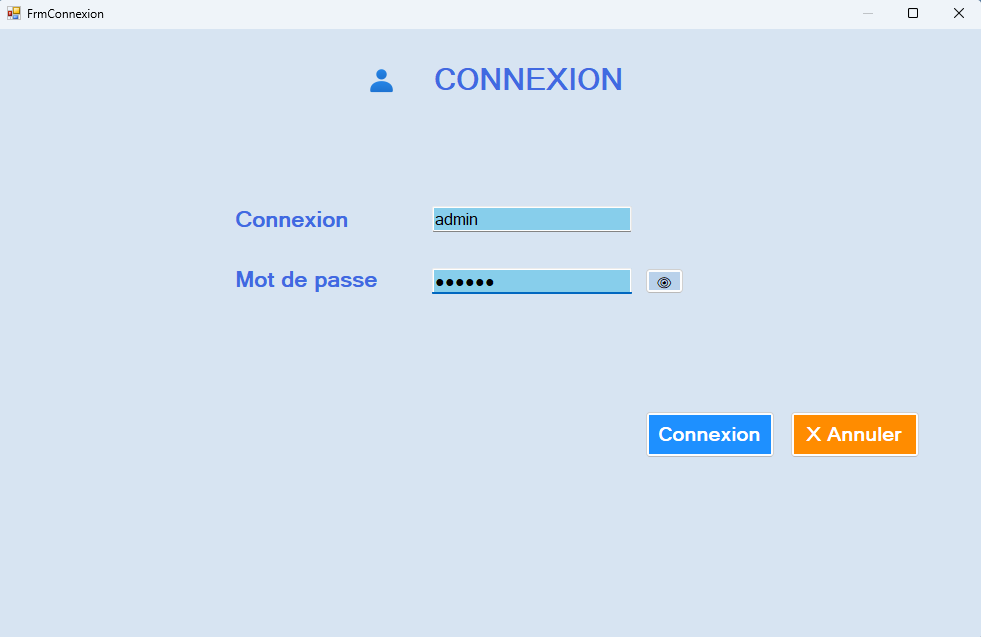
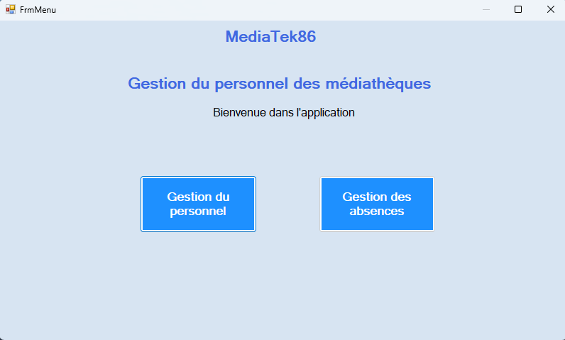
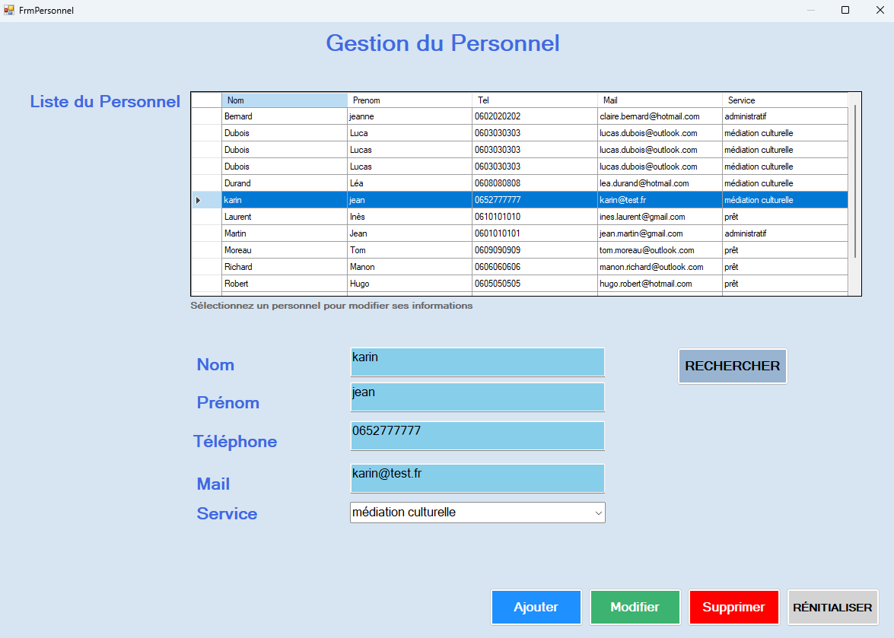
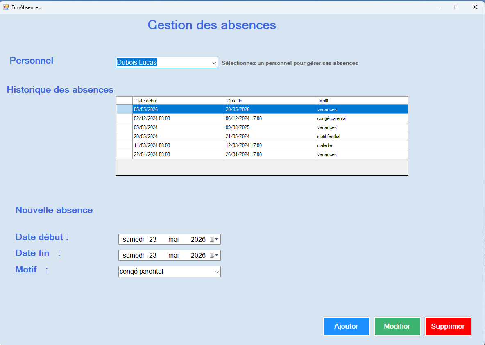
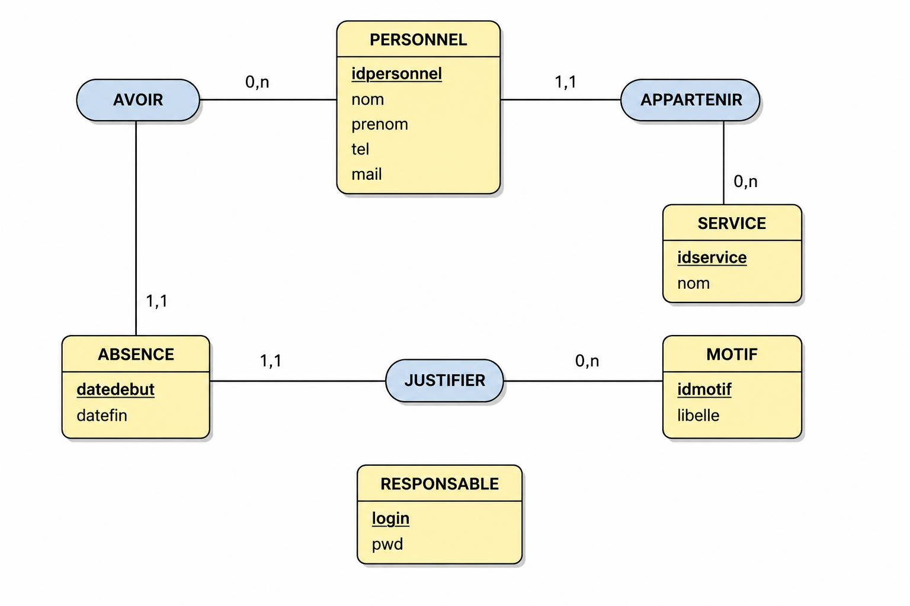

# MediaTek86

## Présentation
Application de gestion du personnel et des absences développée en C# WinForms avec une architecture MVC et une base de données MySQL.

## Fonctionnalités

==> Authentification
- connexion sécurisée
- affichage / masquage du mot de passe

==> Gestion du personnel
- affichage du personnel
- recherche d'un personnel
- ajout d'un nouveau personnel
- modification d'un personnel existant
- suppression d'un personnel existant

==> Gestion des absences
- affichage des absences
- ajout d'une absence
- modification d'une absence
- suppression d'une absence
- contrôle des dates

## Technologies utilisées
- C#
- WinForms
- MySQL
- phpMyAdmin
- Architecture MVC
- Git / GitHub

## Architecture du projet

- model: classes métier
- view: interfaces graphiques WinForms
- controller: gestion des traitements
- dal: accès aux données MySQL
- bddmanager: gestion de la connexion base de données
- installateur: fichiers d'installation de l'application

## Base de données

Base utilisée : mediatek86

## Lancement du projet

1. Importer la base MySQL
2. Vérifier la chaîne de connexion
3. Lancer MediaTek86.exe

## Installation

L'installateur se trouve dans le dossier :

installateur

# Captures d’écran

==> Connexion

==> Menu

==> Gestion du personnel

==> Gestion des absences

# Modèle conceptuel de données (MCD)

## Auteur
Warda SADEQ

Projet réalisé dans le cadre de la formation BTS SIO option SLAM.
